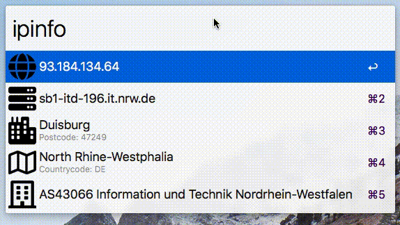

# Ipinfo Workflow for [Alfred 3](https://www.alfredapp.com)
You can get the location of a given ip adress or domain from ipinfo.io. Currently if no ip is provided, your own will be searched by default.  
Returned locations can be displayed in ***OpenStreetMaps*** or ***Google Maps***.
Hostnames can be openend in your default browser via ***http/s***, organizations, city and region information can be searched via ***Google*** or ***DuckDuckGo***.  

# Setup
Just download this workflow from either [GitLab](https://gitlab.com/schwedenmut/alfred-geoip-workflow), the [GitHub](https://github.com/schwedenmut/alfred-ipinfo-workflow) read-only mirror or download the source, compress it, rename it from _\*.zip_ to _\*.alfredworkflow_ and double-click to install. No custom configuration is needed. This workflow uses `/usr/bin/php` to work.
# Commands
To search for an ip adress just type in `ipinfo` followed bei either nothing to query your own ip adress, a valid public ip adress or a URI such as `www.gitlab.com`. 
You can display the location in _**OpenStreetMap**_ by hitting `cmd + enter` (⌘⏎) or in _**Google Maps**_ by operating `alt + enter` (⌥⏎).
Also you can also interact with other provided information via `cmd` (⌘), `alt` (⌥) or just copy all those information by pressing `enter` (⏎).
# Licensing, appreciation
Icons are from [Font Awesome](https://fontawesome.com) under the [CC BY 4.0 License](https://creativecommons.org/licenses/by/4.0/).